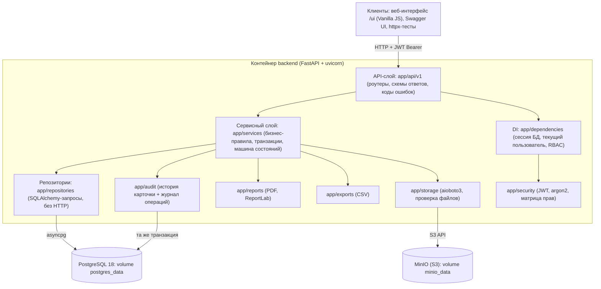
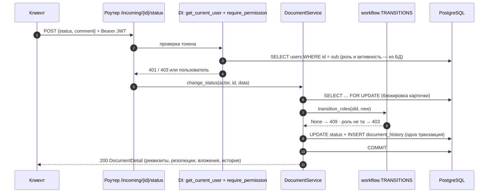
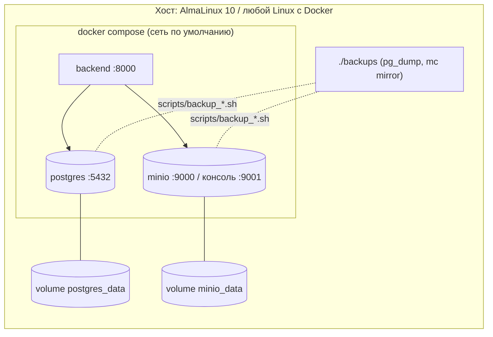

# Архитектура

Клиент-серверная система: REST API на FastAPI, данные в PostgreSQL, файлы в S3-совместимом хранилище MinIO. Все три компонента работают в отдельных контейнерах Docker Compose. Веб-интерфейс — статические файлы (`ui/`), которые раздает тот же контейнер backend по адресу `/ui`; данные он получает только через REST API. Кроме того, API доступен через Swagger UI (`/docs`) и проверяется интеграционными тестами.

## Компоненты и слои



Правила разделения слоев, которые соблюдаются в коде:

1. **Роутеры тонкие.** Роутер объявляет путь, схемы, зависимость прав и вызывает один метод сервиса. Бизнес-логики и SQL в роутерах нет.
2. **Сервисы** содержат все правила: проверки ссылок, дат, переходов статусов, контекстные ограничения доступа. Сервисы управляют транзакциями (явный `commit`); незавершенная транзакция откатывается при закрытии сессии.
3. **Репозитории** знают только SQLAlchemy и ничего не знают о HTTP. Ошибки уровня HTTP возникают в сервисах как прикладные исключения (`app/core/errors.py`) и в единый формат `{detail, code, field}` превращаются в `app/core/handlers.py`.
4. **ORM-модели** (`app/models`) и **Pydantic-схемы** (`app/schemas`) полностью разделены.
5. **Чистые доменные модули** (машина состояний, шаблон номера, контроль сроков, матрица прав, расчет показателей отчетов, CSV, проверка файлов) не зависят от БД и HTTP и покрыты unit-тестами.

## Прохождение запроса (пример: смена статуса)



## Веб-интерфейс

Каталог `ui/` — четыре файла без сборки: `index.html`, `api.js`, `app.js`, `styles.css`. FastAPI монтирует его через `StaticFiles` (`app/main.py`). Это единственное изменение backend ради интерфейса; корень `/` перенаправляет на `/ui/`.

- `api.js` — единственное место, где выполняются HTTP-запросы. Он подставляет `Authorization: Bearer`, превращает ответы `{detail, code, field}` в `ApiError` и при 401 очищает токен.
- `app.js` — маршрутизация по `#`-адресам (`#/documents`, `#/documents/{id}?tab=…`, `#/correspondents`, `#/reports`, `#/users`, `#/dictionaries`), экраны ролей, формы, валидация и уведомления. Разметка строится через `document.createElement`, данные выводятся как текст (без `innerHTML`), поэтому HTML в данных не исполняется.
- Видимость разделов и кнопок вычисляется из разрешений `GET /auth/me`. Это удобство, а не защита: права и переходы статусов проверяет backend, интерфейс лишь показывает его ответ.

## Сквозные механизмы

| Механизм | Реализация |
|---|---|
| Аутентификация | `POST /auth/login` выдает JWT (HS256), в котором только `sub` = user_id и срок жизни. Роль и активность при каждом запросе читаются из БД, поэтому смена роли или деактивация действуют сразу. |
| RBAC | `app/security/permissions.py`: словарь «роль → набор разрешений», единственный источник истины. Проверку выполняет зависимость `require_permission(...)` на каждом эндпоинте. Контекстные ограничения (исполнитель видит только свои поручения) — в `app/services/access.py`. |
| Транзакции | Регистрация, смена статуса, создание и редактирование резолюций, загрузка файла выполняются в одной транзакции вместе с записью истории. Карточка блокируется `SELECT … FOR UPDATE`. |
| Номер регистрации | Атомарный `INSERT … ON CONFLICT DO UPDATE … RETURNING` в `registration_counters`, формат из `REG_NUMBER_TEMPLATE`, плюс `UNIQUE` в БД. |
| Файлы | Проверки: расширение, MIME и сигнатура содержимого, размер не более `MAX_UPLOAD_SIZE_MB`. Ключ хранения генерирует сервер. Скачивание — потоковый ответ через backend после RBAC-проверки; MinIO наружу не публикуется. |
| Контроль сроков | `app/services/deadlines.py`: состояния `ok`, `warning` (осталось не больше `DEADLINE_WARNING_DAYS` дней), `overdue`, `closed`. Выводятся в каждой карточке, есть фильтр `deadline_state`, учитываются в отчетах. |
| Журналирование | История карточки хранится в БД. Остальные операции (вход, неудачный вход, пользователи, отчеты, выгрузки, удаление) пишутся структурированными строками `action=… actor=…` в stdout. Пароли, JWT и ключи S3 в логи не попадают. |
| Health | `GET /health` и `GET /api/v1/health` проверяют `SELECT 1` в БД и `head_bucket` в S3. Ответ 200 или 503. |
| Остановка | uvicorn запускается через `exec`, получает SIGTERM и завершает активные запросы (`--timeout-graceful-shutdown 20`). В lifespan закрывается пул соединений. |

## Развертывание



У всех сервисов есть healthcheck и политика `restart: unless-stopped`. Backend стартует после того, как postgres и minio прошли healthcheck, и при старте применяет миграции (`alembic upgrade head`). Порты PostgreSQL и MinIO опубликованы только на `127.0.0.1`.

## Структура каталогов

```
app/
  main.py               приложение, lifespan, OpenAPI-теги, монтирование /ui
  core/                 config (Pydantic Settings), errors, handlers (формат ошибок), logging
  db/                   Base (naming convention), engine и сессии
  models/               ORM-модели (entities.py) и перечисления (enums.py)
  schemas/              Pydantic-схемы запросов и ответов
  repositories/         доступ к данным
  services/             бизнес-логика; workflow.py, reg_number.py, deadlines.py, access.py
  dependencies/         DI: get_db, get_current_user, require_permission, фабрики сервисов
  security/             permissions.py (матрица), tokens.py (JWT), passwords.py (argon2)
  storage/              s3.py (MinIO), validation.py (файлы)
  reports/              pdf.py (ReportLab), stats.py (показатели)
  exports/              csv_export.py
  audit/                recorder.py (история и журнал операций)
  api/v1/               роутеры
alembic/                миграции
scripts/                seed.py, entrypoint.sh, backup/restore
tests/unit/             чистая логика
tests/integration/      REST API + PostgreSQL + MinIO
docs/                   диаграммы и документация
ui/                     веб-интерфейс: index.html, api.js, app.js, styles.css
```

## Совместимость с Draw.io

Все диаграммы в `docs/` написаны на Mermaid. В Draw.io (diagrams.net) их можно вставить через **Arrange → Insert → Advanced → Mermaid** и доработать вместе с диаграммами курсовой. Диаграмма вариантов использования дополнительно приведена на PlantUML в `docs/use-case.md`.
