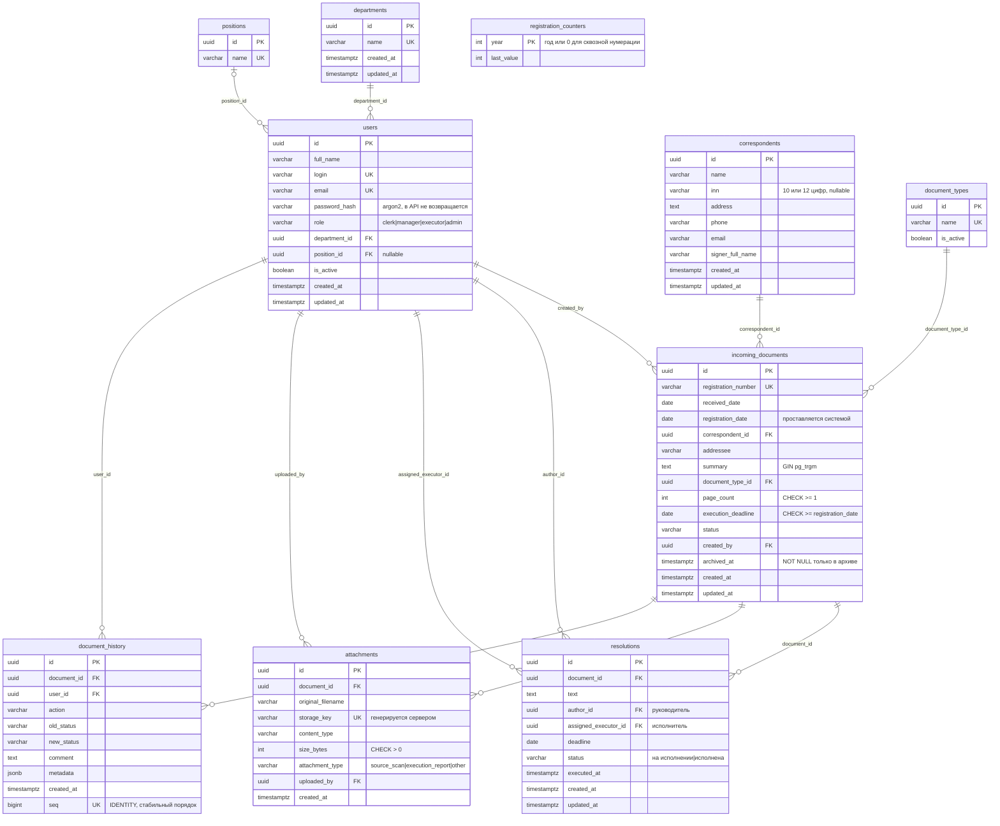

# Схема данных

СУБД — PostgreSQL 18. Схема создается миграцией Alembic `alembic/versions/0001_initial.py`, ORM-модели описаны в `app/models/entities.py`. Тест `tests/integration/test_docs_schema.py` сверяет ER-диаграмму ниже с ORM-моделями (набор таблиц и столбцов).

## Сущности и правила

**users.** Пароль хранится только как argon2-хэш; поле `password_hash` отсутствует во всех схемах ответа. Пользователь не удаляется физически (эндпоинта удаления нет, внешние ключи `ON DELETE RESTRICT`), вместо этого выполняется деактивация (`is_active = false`). Деактивированный пользователь не может войти, а уже выданный ему токен перестает работать сразу, потому что активность и роль читаются из БД при каждом запросе.

**incoming_documents.** Регистрационный номер уникален на уровне БД (`UNIQUE`). Дата регистрации ставится сервером (часовой пояс `APP_TIMEZONE`). Ограничения `CHECK`: `page_count >= 1`, `execution_deadline >= registration_date`, допустимые значения `status`, а также согласованность архива: `archived_at` заполнен тогда и только тогда, когда статус «в архиве».

**registration_counters.** Счетчики номеров. Инкремент выполняется одним оператором `INSERT … ON CONFLICT DO UPDATE … RETURNING`, который блокирует строку счетчика до конца транзакции регистрации. Параллельные регистрации поэтому получают разные номера, а при откате транзакции счетчик откатывается вместе с ней, и пропусков нет. Если в шаблоне номера есть год, нумерация начинается заново каждый год, иначе ведется сквозная (ключ `0`).

**resolutions.** Один документ может иметь несколько резолюций. Каждая резолюция относится к одному документу и одному исполнителю. Автор — только руководитель (проверяется RBAC), исполнитель — только активный пользователь с ролью `executor` (проверяется сервисом).

**attachments.** Файл хранится в MinIO под ключом `documents/<document_id>/<uuid>.<ext>`. Исходное имя сохраняется только для отображения и в `Content-Disposition` при скачивании.

**document_history.** Журнал действий по карточке. Запись создается в той же транзакции, что и само действие. Через API история доступна только для чтения. Коды действий: `document_registered`, `document_updated` (в `metadata.changes` — старое и новое значение каждого поля), `status_changed`, `document_annulled`, `resolution_created`, `resolution_updated`, `resolution_executed`, `file_attached`.

**Удаление карточки** (только администратор) каскадно удаляет ее резолюции, вложения и историю (`ON DELETE CASCADE`), затем объекты удаляются из MinIO. Факт удаления фиксируется в журнале приложения (stdout).

## Индексы

| Таблица | Индекс |
|---|---|
| incoming_documents | `registration_number` (UNIQUE), `received_date`, `registration_date`, `correspondent_id`, `document_type_id`, `execution_deadline`, `status`, `created_by`, GIN `pg_trgm` по `summary` |
| resolutions | `document_id`, `assigned_executor_id`, `status` |
| users | `login` (UNIQUE), `email` (UNIQUE), `role`, `department_id` |
| correspondents | `name`, `inn` |
| attachments | `document_id`, `storage_key` (UNIQUE) |
| document_history | `document_id`, `seq` (UNIQUE) |

Значения перечислений (роли, статусы, типы вложений) хранятся как `VARCHAR` с ограничением `CHECK`, без нативного `ENUM` PostgreSQL. Так новые значения добавляются обычной миграцией без `ALTER TYPE`.
