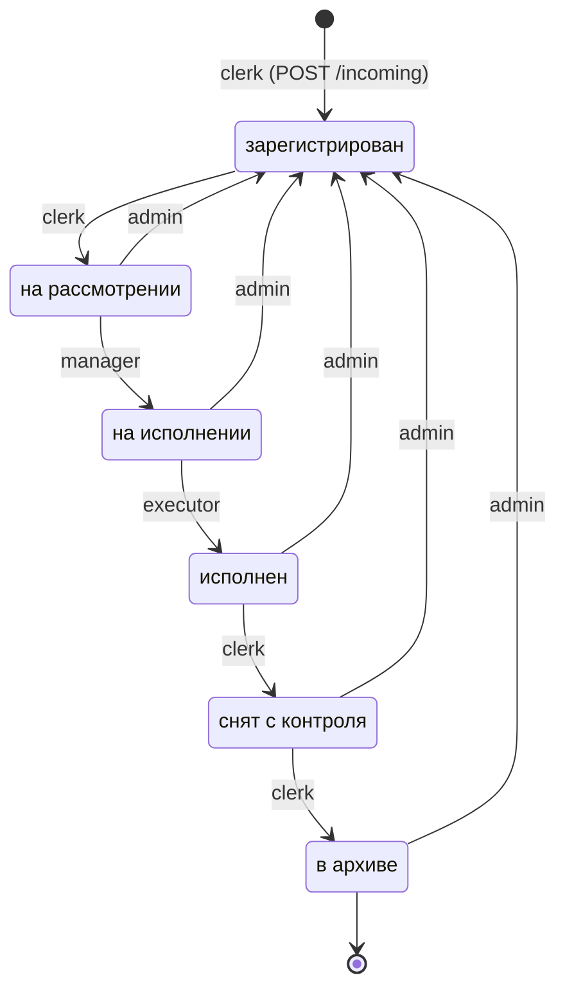
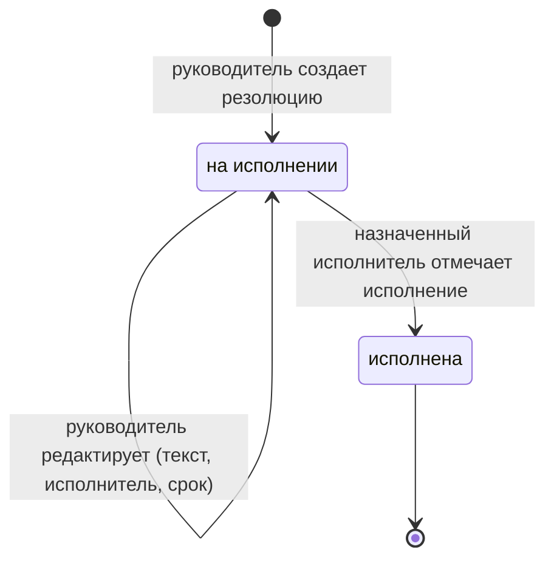

# Диаграмма состояний карточки документа

Источник истины — словарь `TRANSITIONS` в `app/services/workflow.py`. Диаграмма ниже сгенерирована из него,
а тест `tests/unit/test_docs_consistency.py` проверяет, что она не разошлась с кодом (каждая стрелка и роль).

## Матрица переходов

| Из статуса | В статус | Кто | Как выполняется |
|---|---|---|---|
| — | зарегистрирован | делопроизводитель | `POST /incoming` (регистрация) |
| зарегистрирован | на рассмотрении | делопроизводитель | `POST /incoming/{id}/status` |
| на рассмотрении | на исполнении | руководитель | автоматически при `POST /incoming/{id}/resolutions` |
| на исполнении | исполнен | исполнитель | `POST /incoming/{id}/status`; см. правило ниже |
| исполнен | снят с контроля | делопроизводитель | `POST /incoming/{id}/status` |
| снят с контроля | в архиве | делопроизводитель | `POST /incoming/{id}/status`, проставляется `archived_at` |
| любой, кроме «зарегистрирован» | зарегистрирован | администратор | `POST /incoming/{id}/status` (аннулирование), `archived_at` сбрасывается |

## Правила проверки

1. Переход, которого нет в матрице, отклоняется с **409** `INVALID_STATUS_TRANSITION` (например, «зарегистрирован» → «исполнен»).
2. Существующий переход, выполняемый не той ролью, отклоняется с **403** `FORBIDDEN`.
3. Смена статуса выполняется под блокировкой строки документа (`SELECT … FOR UPDATE`), поэтому два параллельных запроса не могут провести документ через один переход дважды.
4. Каждая смена статуса пишется в `document_history` в той же транзакции: автор, время, старый и новый статус, комментарий.
5. **Исполнение при нескольких резолюциях.** Исполнитель отмечает исполнение своих резолюций (`resolution_executed` в истории). Документ переходит в «исполнен» только тогда, когда не осталось резолюций «на исполнении». Запись о смене статуса делается от имени исполнителя, закрывшего последнюю резолюцию.
6. В статусе «в архиве» документ не редактируется (409 `DOCUMENT_ARCHIVED`), и к нему нельзя прикреплять файлы.
7. Резолюции создаются и редактируются, пока документ «на рассмотрении» или «на исполнении», а сама резолюция не исполнена (иначе 409 `RESOLUTION_LOCKED`).

## Статусы резолюции

