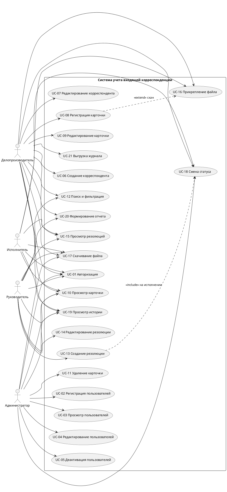

# Варианты использования

Диаграмма согласована с матрицей прав в `app/security/permissions.py`: у каждого прецедента указан эндпоинт, где он реализован, и разрешение, которое проверяет backend. В курсовой 21 прецедент; ниже они пронумерованы UC-01…UC-21. Дополнительно реализованы справочники и служебные функции, перечисленные в конце.

```mermaid
flowchart LR
    clerk(["👤 Делопроизводитель"])
    manager(["👤 Руководитель"])
    executor(["👤 Исполнитель"])
    admin(["👤 Администратор"])

    subgraph system["Система учета входящей корреспонденции"]
        UC01(("UC-01 Авторизация"))
        UC02(("UC-02 Регистрация пользователей"))
        UC03(("UC-03 Просмотр пользователей"))
        UC04(("UC-04 Редактирование пользователей"))
        UC05(("UC-05 Деактивация пользователей"))
        UC06(("UC-06 Создание корреспондента"))
        UC07(("UC-07 Редактирование корреспондента"))
        UC08(("UC-08 Регистрация карточки документа"))
        UC09(("UC-09 Редактирование карточки"))
        UC10(("UC-10 Просмотр карточки"))
        UC11(("UC-11 Удаление карточки"))
        UC12(("UC-12 Поиск и фильтрация"))
        UC13(("UC-13 Создание резолюции"))
        UC14(("UC-14 Редактирование резолюции"))
        UC15(("UC-15 Просмотр резолюций"))
        UC16(("UC-16 Прикрепление файла"))
        UC17(("UC-17 Скачивание файла"))
        UC18(("UC-18 Смена статуса"))
        UC19(("UC-19 Просмотр истории"))
        UC20(("UC-20 Формирование отчета PDF"))
        UC21(("UC-21 Выгрузка журнала CSV"))
    end

    clerk --- UC01 & UC06 & UC07 & UC08 & UC09 & UC10 & UC12 & UC15 & UC16 & UC17 & UC18 & UC19 & UC20 & UC21
    manager --- UC01 & UC10 & UC12 & UC13 & UC14 & UC15 & UC17 & UC19 & UC20
    executor --- UC01 & UC10 & UC15 & UC16 & UC17 & UC18 & UC19
    admin --- UC01 & UC02 & UC03 & UC04 & UC05 & UC10 & UC11 & UC17 & UC18 & UC19
```

## Таблица прецедентов

| № | Прецедент | Роли | Эндпоинт | Разрешение |
|---|---|---|---|---|
| UC-01 | Авторизация | все | `POST /auth/login`, `GET /auth/me` | — |
| UC-02 | Регистрация пользователей | администратор | `POST /users` | `user:create` |
| UC-03 | Просмотр пользователей | администратор | `GET /users`, `GET /users/{id}` | `user:view` |
| UC-04 | Редактирование пользователей | администратор | `PATCH /users/{id}` | `user:edit` |
| UC-05 | Деактивация пользователей | администратор | `POST /users/{id}/deactivate` | `user:deactivate` |
| UC-06 | Создание корреспондента | делопроизводитель | `POST /correspondents` | `correspondent:create` |
| UC-07 | Редактирование корреспондента | делопроизводитель | `PATCH /correspondents/{id}` | `correspondent:edit` |
| UC-08 | Регистрация карточки документа | делопроизводитель | `POST /incoming` (+ `POST /incoming/{id}/files` для скана) | `document:register` |
| UC-09 | Редактирование карточки | делопроизводитель | `PATCH /incoming/{id}` | `document:edit` |
| UC-10 | Просмотр карточки | делопроизводитель, руководитель, исполнитель (свои), администратор (чтение) | `GET /incoming/{id}`, `GET /incoming/by-registration-number/{n}`, `GET /incoming` | `document:view` |
| UC-11 | Удаление карточки | администратор | `DELETE /incoming/{id}` | `document:delete` |
| UC-12 | Поиск и фильтрация | делопроизводитель, руководитель | `GET /incoming?…` | `document:search` |
| UC-13 | Создание резолюции | руководитель | `POST /incoming/{id}/resolutions` | `resolution:create` |
| UC-14 | Редактирование резолюции | руководитель | `PATCH /resolutions/{id}` | `resolution:edit` |
| UC-15 | Просмотр резолюций | делопроизводитель, руководитель, исполнитель (свои) | `GET /incoming/{id}/resolutions` | `resolution:view` |
| UC-16 | Прикрепление файла | делопроизводитель (скан), исполнитель (отчет) | `POST /incoming/{id}/files` | `file:attach` |
| UC-17 | Скачивание файла | все, кто может просматривать карточку | `GET /files/{id}/download` | `document:view` + контекст |
| UC-18 | Смена статуса | делопроизводитель, исполнитель, администратор (аннулирование) | `POST /incoming/{id}/status` | `document:change_status` / `document:annul` + матрица переходов |
| UC-19 | Просмотр истории | все, кто может просматривать карточку | `GET /incoming/{id}/history` | `document:view` + контекст |
| UC-20 | Формирование отчета | делопроизводитель, руководитель | `POST /reports/generate` | `report:generate` |
| UC-21 | Выгрузка журнала регистрации | делопроизводитель | `GET /exports/registration-log` | `export:registry` |

Кроме прецедентов, реализованы: просмотр списка корреспондентов (`GET /correspondents`), справочники подразделений, должностей и типов документов (администратор), список активных исполнителей для назначения резолюций (`GET /users/executors`), проверка состояния (`GET /health`).

## Основной сценарий (жизненный цикл документа)

1. Делопроизводитель создает корреспондента (UC-06), регистрирует карточку (UC-08) и прикрепляет скан (UC-16). Система присваивает номер `ВХ-2026-000001` и дату регистрации.
2. Делопроизводитель передает документ руководителю: «зарегистрирован» → «на рассмотрении» (UC-18).
3. Руководитель создает резолюцию с исполнителем и сроком (UC-13). Документ автоматически переходит «на исполнении».
4. Исполнитель видит поручение в своем списке (UC-10, UC-15), прикрепляет отчетные материалы (UC-16) и отмечает исполнение (UC-18). Когда исполнены все резолюции, документ становится «исполнен».
5. Делопроизводитель снимает документ с контроля и передает в архив (UC-18). После этого карточку нельзя редактировать.
6. Все шаги видны в истории карточки (UC-19), а также попадают в отчеты (UC-20) и журнал регистрации (UC-21).

## PlantUML (для импорта в Draw.io / PlantUML-редакторы)

